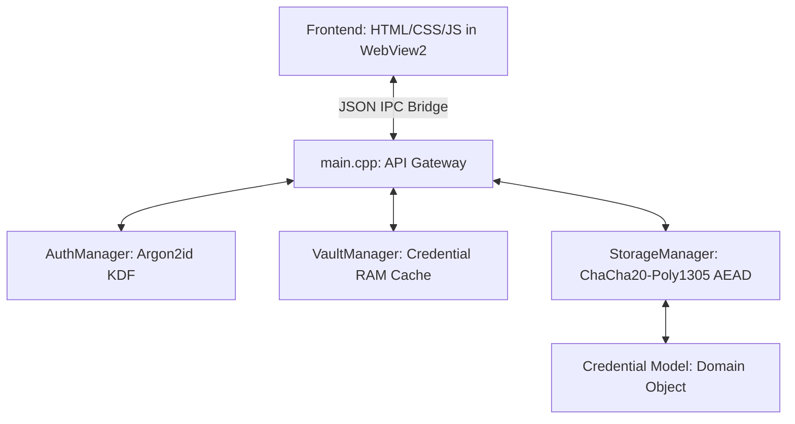

# Secure Vault C++ 🔒

An offline-first, cryptographically secure, and aesthetically premium desktop password manager built with **C++17**, **Edge WebView2**, **Argon2id KDF**, and **ChaCha20-Poly1305 AEAD** encryption.

---

## 🏗️ Architecture & Core Components

The application follows a locally hosted, client-server hybrid pattern, separating concerns cleanly across UI rendering, controller logic, and backend security managers.



### Technical Design Patterns
1. **Local MVC Hybrid**: WebView2 acts as the **View** rendering high-fidelity components, while the C++ backend acts as the **Controller** and **Model**.
2. **Zero-IPC Attachment Pipeline**: Large binary files (up to 2MB) are processed and cached strictly inside native memory. Only the attachment metadata is shared with the frontend over the WebView JSON bridge, preventing V8 heap fragmentation and UI freezes.
3. **RAII (Resource Acquisition Is Initialization)**: Files, locks, and heap buffers are managed through C++ scope boundaries to guarantee automatic resource cleanup and prevent leaks.

---

## 🛡️ Security & Cryptographic Strengths

*   **Argon2id Key Derivation**: Derives encryption keys using the Argon2id KDF (16MB memory / 4 passes / 1 lane config), ensuring industry-standard protection against GPU-accelerated brute-force attacks.
*   **ChaCha20-Poly1305 AEAD**: Provides authenticated encryption for database records via Monocypher, safeguarding data from ciphertext tampering.
*   **Memory Pinning & Locking (`VirtualLock`)**: Sensitive secrets (master passwords, derived keys, decrypted files) are pinned in physical RAM, preventing the OS from paging them out to swapfiles (`pagefile.sys`).
*   **Volatile Memory Scrubbing**: Employs compiler-optimized zero-out loops to immediately obliterate key buffers from memory as soon as they are no longer needed.
*   **Self-Destruct Panic Switch**: Automatically tracks consecutive failed login attempts. On the **10th consecutive failure**, it shreds the local database, config files, and all backup files using physical zero-byte overrides before deleting them.
*   **Delimiter Safety**: Escapes storage delimiters (`|`, `;`) and backslashes (`\`) statefully to prevent database parsing corruption while maintaining complete backward compatibility with legacy vault files.

---

## ✨ Features & Capabilities

*   **Conditional Clipboard Safe-Clearing**: Automatically clears the clipboard after 20 seconds. Compares clipboard contents before clearing to ensure user-copied text is preserved if changed.
*   **Inactivity Auto-Lock**: Automatically locks the vault based on focused window inactivity (5 minutes), system-wide idle state (2 minutes via Win32 `GetLastInputInfo`), OS power suspension (`PBT_APMSUSPEND`), or session locking (`WTS_SESSION_LOCK`).
*   **Offline TOTP 2FA**: Generates rolling HMAC-SHA1 TOTP tokens entirely offline with an interactive countdown ring.
*   **Encrypted Attachment Manager**: Attach any file (up to 2MB) per credential. Decrypts and saves to disk on-demand via native Win32 save dialogs.
*   **Automated Backup Rotation**: Creates a timed, encrypted backup before every database save, keeping only the 5 most recent files.
*   **Local Storage Polyfill**: Bridges WebView2's sandboxed local storage to C++ configuration endpoints, saving configurations locally.
*   **Security Auditor Dashboard**: Computes metrics and renders an interactive SVG ring showing an overall security score.
*   **Keyboard Command Palette**: Press `Ctrl + K` to open the search overlay, select credentials, or change themes instantly using keyboard keys.

---

## 📂 Codebase Structure

```
├── include/
│   ├── auth/            # Master password registration and verification
│   ├── encryption/      # ChaCha20-Poly1305 wrappers
│   ├── models/          # Credential domain models (delimiter-safe serialization)
│   ├── storage/         # StorageManager (atomic file I/O & backup rotation)
│   ├── utils/           # Extracted utility libraries
│   │   ├── SecurityUtils.h   # RAM locking, volatile scrubbing
│   │   ├── CryptoUtils.h     # SHA1, HMAC, Base32/64, TOTP
│   │   ├── SystemUtils.h     # Native Win32 dialogs, idle trackers
│   │   ├── StringUtils.h     # CSV parsing, quote splitters
│   │   └── GeneratorUtils.h  # SecRandom generators
│   └── web/             # Web portal wrapper and HTML view
├── src/
│   ├── auth/, encryption/, storage/, vault/, utils/, web/  # Source implementations
│   └── main.cpp         # Gateway API controller & IPC bindings
├── tests/
│   └── test_delimiter.cpp  # Delimiter safety and Zero-IPC regression tests
└── CMakeLists.txt       # Build system configuration
```

---

## 🛠️ Build and Compilation Guide

### Prerequisites
*   **C++17 Compiler** (GCC/MinGW 13.2+ or MSVC 2022+)
*   **CMake 3.15+**
*   **Windows 10/11** (for Edge WebView2 bindings)

### Compilation Steps
1.  Generate the build files (enables high-performance SIMD optimizations `/O2` or `-O3` in release configurations):
    ```powershell
    cmake -B build -DCMAKE_BUILD_TYPE=Release
    ```
2.  Build the project:
    ```powershell
    cmake --build build --config Release
    ```
3.  Copy the compiled binary to the root directory:
    ```powershell
    Copy-Item -Path "build/password_manager.exe" -Destination "." -Force
    ```

---

## 🧪 Running Unit & Integration Tests

The test suite validates delimiter escaping, backward compatibility with unescaped vault rows, and Zero-IPC file attachment state machines.

1.  Compile the test executable:
    ```powershell
    g++ -std=c++17 tests/test_delimiter.cpp -o build/test_delimiter.exe
    ```
2.  Run the tests:
    ```powershell
    .\build\test_delimiter.exe
    ```